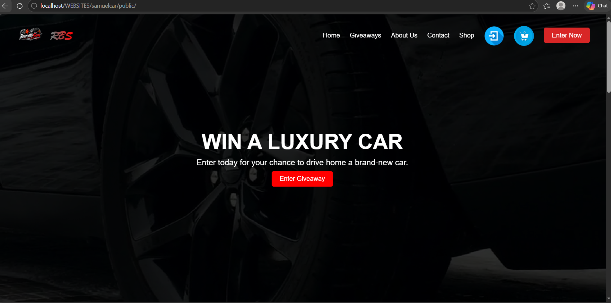
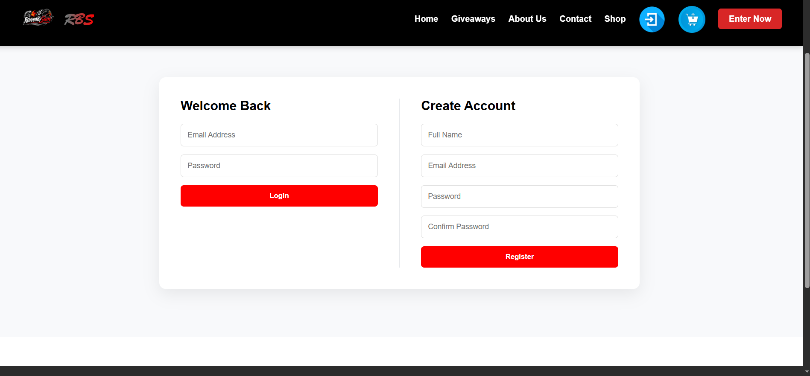
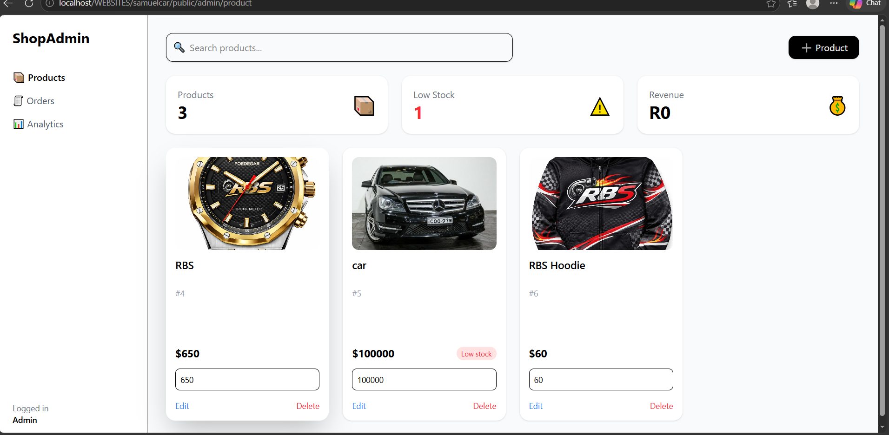
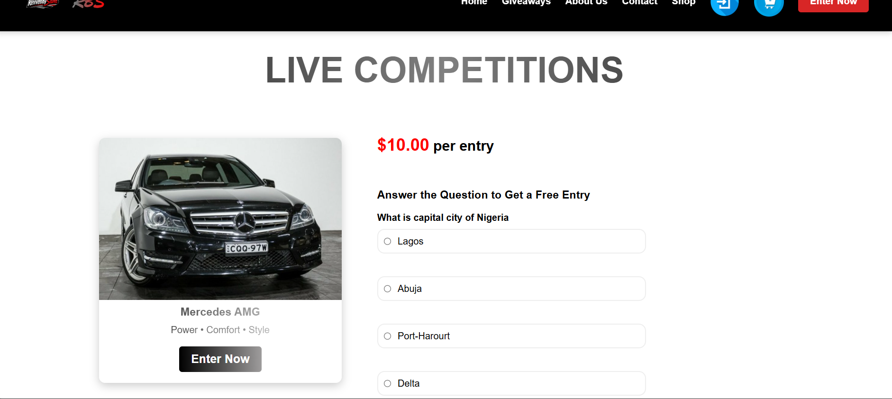
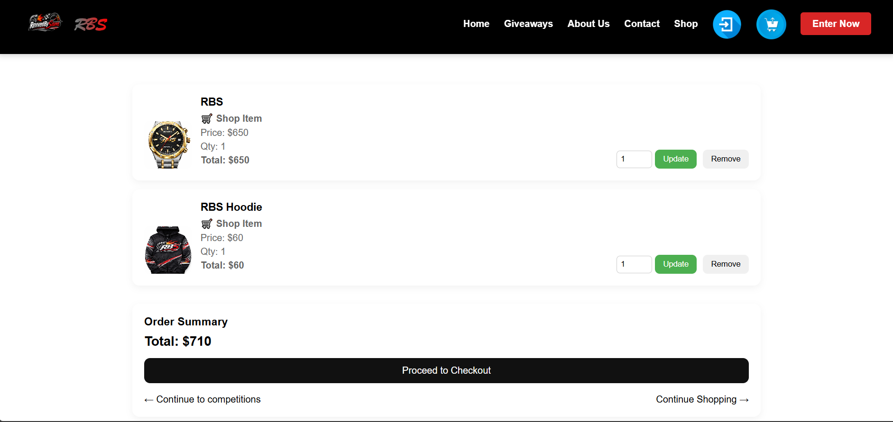
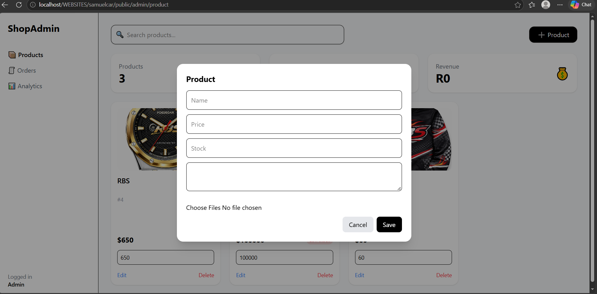
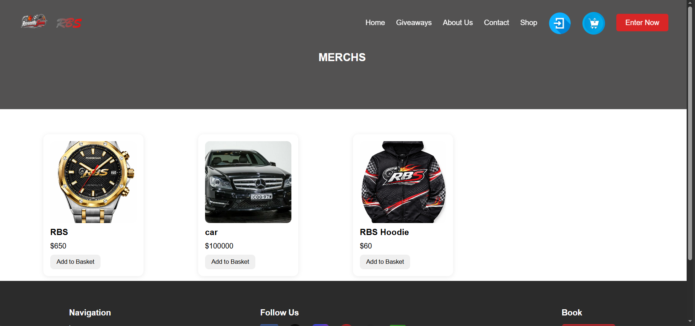

# Samuel Car

A full-stack Laravel web application for managing an online car competition and e-commerce platform.

## Overview

Samuel Car is a full-stack web application designed to provide users with an online platform for participating in car competitions and purchasing merchandise.

The system includes competition management, ticket purchasing, user authentication, shopping basket functionality, merchandise management and administrative functionality.

## Features

### Customer Features

- User registration and authentication
- Browse available car competitions
- View competition details
- Purchase competition tickets
- Add tickets to a shopping basket
- Adjust ticket quantities
- Answer competition skill questions
- Receive free tickets through the skill-question system
- Browse merchandise
- Add merchandise to the basket
- Separate handling of competition tickets and merchandise

### Administration

- Competition management
- Product management
- Product pricing and stock management
- Product image/media management
- Competition entry management
- Administrative dashboard
- Sales and product information

## Technologies

- Laravel
- PHP
- MySQL
- Blade
- Livewire
- Tailwind CSS
- Vite
- JavaScript
- HTML5
- CSS3
- Git
- GitHub

## Technical Highlights

The project demonstrates experience with:

- MVC architecture
- Database relationships
- Authentication and authorization
- CRUD operations
- Session management
- Shopping basket functionality
- File and media management
- Dynamic interfaces
- Database migrations
- Eloquent ORM
- Responsive UI development
- Git version control

  ## 📸 Application Screenshots

  ### home

### Login

### Dashboard

### Competition

### Checkout

### addproducts

### Shop

## Project Structure

The application follows Laravel's standard MVC architecture:

- `app/` - Application logic, models and controllers
- `resources/` - Blade views, CSS and JavaScript
- `routes/` - Application routes
- `database/` - Migrations, seeders and factories
- `public/` - Public assets
- `storage/` - Application-generated files

## Deployment

The application is currently maintained as a development and portfolio project.

### Current Environment

- Local Laravel development environment
- GitHub source-code repository
- Database configured for local development

### Source Code

The complete source code is available in this repository.

> Live demo deployment is planned as a future improvement.
